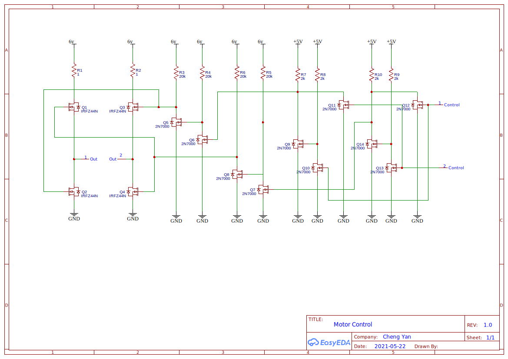

# double-pi
This project using raspberry pi 3 or 4 to control the circuit described in the below schematic.
On the raspberry pi, connect GPIO pin 22 to one of the input in the schematic and connect GPIO 23 to the other input on the schematic.

# Running Debug script:
The script will set pin 22 or pin 23 high then low.  You can control the time by entering:

* on_number:dir:off_number
  * ex: 100:f:10
    * will set pin high for 100*100k clock cycle, then set pin low for 10*100k clock cycle
* Using negative number to disable the on/off clock cycle
  * ex: 100:f:-1
    * will set a pin high for 100*100k clock cycle, but will not set low

# Python?
will try python later, using Java for now, but it's a bit slow due to the jvm.

