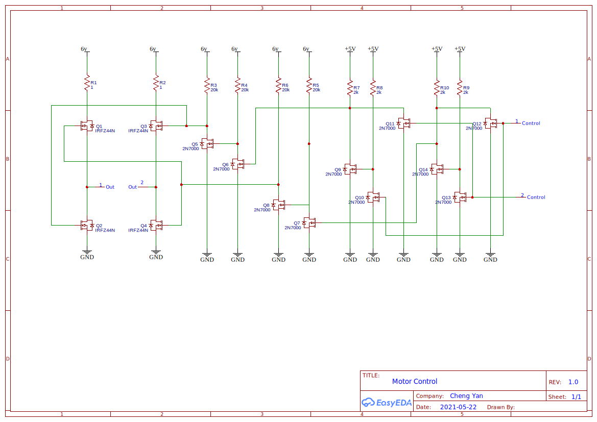

# double-pi
This project using raspberry pi 3 or 4 to control the circuit described in the below schematic.
On the raspberry pi, connect GPIO pin 22 to one of the input in the schematic and connect GPIO 23 to the other input on the schematic.

## Schematic
The CMOS transistor [IRFZ44N](https://www.infineon.com/cms/en/product/power/mosfet/12v-300v-n-channel-power-mosfet/irfz44n/) is a power transistor that can drain a lot of current.  The set up will allow me to control the direction of the current flow.   The "out" pins will connect to the motor that drives robot.

After this, the 2 sets of 2-[2N7000](https://www.onsemi.com/pdf/datasheet/nds7002a-d.pdf) transistor will provide the on votage for the IRFZ44N.  A "high enough" Ω resistor is required.  I use a 20kΩ.

After this we have 2 sets of 3 2N7000.  This setup is an XOR logic that prevent both input pin to go high which will short the IRFZ44N series.

# Running Debug script:
The script will set pin 22 or pin 23 high then low.  You can control the time by entering:

* on_number:dir:off_number
  * ex: 100:f:10
    * will set pin high for 100*100k clock cycle, then set pin low for 10*100k clock cycle
* Using negative number to disable the on/off clock cycle
  * ex: 100:f:-1
    * will set a pin high for 100*100k clock cycle, but will not set low

## The code
The circuit does not have a way to control the speed of the motor due to the binary logic control and the CMOS transistors.  However, I use software to control the speed by controling the timing of the on/off frequencies.  This allows me to turn it fully on to fully off... and anywhere in between.

## Run the code

* ./run action=forward
* ./run action=backward
* ./run action=off

# Python?
will try python later, using Java for now, but it's a bit slow due to the jvm.

# The final product

